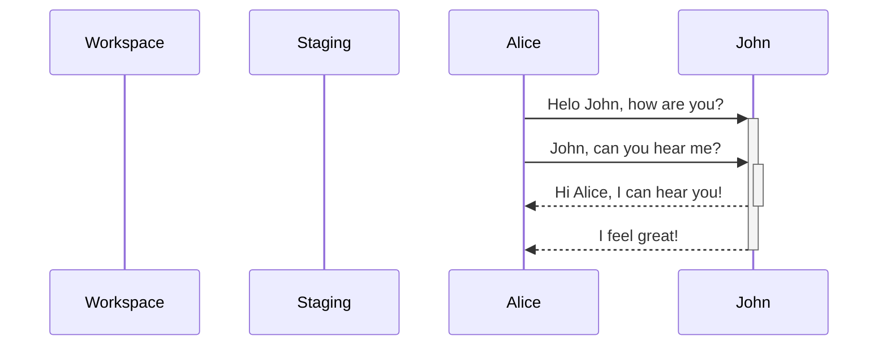

Git is a distributed version control system for tracking changes in source code during software development.

```mermaid
sequenceDiagram
  participant Workspace
  participant Staging
	Alice->>+John: Helo John, how are you?
	Alice->>+John: John, can you hear me?
	John-->>-Alice: Hi Alice, I can hear you!
	John-->>-Alice: I feel great!
```