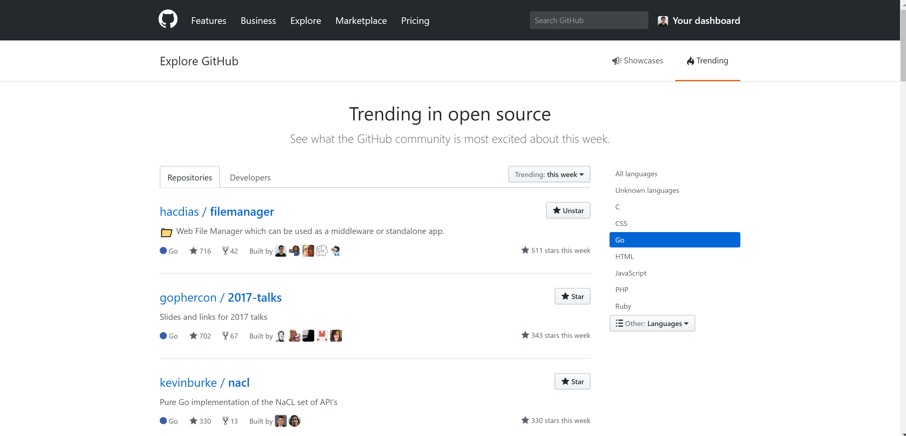

In July 2017, something unexpected happened: I opened the trending page on the GitHub interface, under the Go language and saw my own project there. [File Browser](https://github.com/filebrowser/filebrowser) - then still called File Manager -, was trending in first place under the Go language!

<!--more-->

At the time, that allowed the project to go from around 200 stars to over 700 during that week. Nowadays, this project I started long ago has over 22k GitHub stars ⭐️. Despite no longer maintaining it, I'm grateful to the current maintainers for continuing the project.

